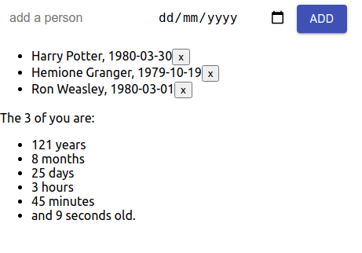

# Age aggregator

Finding out how old the crowd is.



You can't see it on the screenshot, but the seconds actually tick, thanks to:

```js
componentDidMount() {
    this.interval = setInterval(() => this.tick(), 1000)
}
```

Clone the repo, `cd` into it, launch with `npm run start`.
